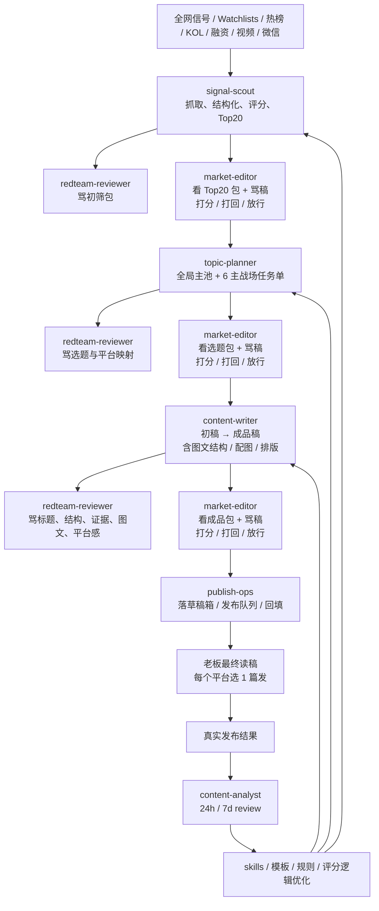

# 同行资本市场内容系统｜多 Agent 责任矩阵（2026-03-27 正式融合版）

## 1. 文档目的

这份文档是内容工厂当前阶段的正式组织边界文件。

它解决四件事：

1. 内容工厂一共拆成几个 agent
2. 每个 agent 到底负责什么、不负责什么
3. 每个工序如何交接、如何被审核、如何被打回
4. 6 个主战场与 1 个 SEO 镜像层，分别由谁在什么阶段做决策

这份文档吸收了两轮方案：

- 原系统方案：前台单口子、后台按责任面拆分
- 最新业务方案：信息源初筛、选题官、审核员、总管理打分与打回机制

最终结论是：

> **当前正式采用 `7` 个 agent 的组织法。**

其中：

- `6` 个是业务主工位
- `1` 个是唯一前台总管理

---

## 2. 总原则

### 2.1 前台永远只有一个口子

- 老板只和 `market-editor` 交互
- 其他所有后台 agent 不允许越级回报
- 后台观点必须先沉淀成正式对象，再由 `market-editor` 汇总输出

### 2.2 按责任面拆，不按平台拆

当前阶段不按：

- 微信 agent
- 小红书 agent
- 知乎 agent

这样的平台维度拆分。

当前正式按责任面拆分：

- 抓源与初筛
- 选题与平台映射
- 写稿与成品化
- 审核与挑错
- 发布与交付
- 复盘与进化

### 2.3 每个工序都要经过“交付稿 + 骂稿 + 裁判打分”

除日常原始抓取外，正式业务工序统一遵循下面的 gate：

1. 干活 agent 交付正式结果
2. `redteam-reviewer` 只负责找问题、出骂稿
3. `market-editor` 同时看交付稿和骂稿
4. `market-editor` 按 `1-10` 分打分
5. `8` 分以下，一律打回
6. 打回时必须写清具体原因与修改方向
7. `8` 分及以上，才能进入下一工序

### 2.4 打分对象是“阶段交付包”，不是单条素材

为了避免系统吞吐量崩掉，打分不作用在单条 source packet 上，而作用在阶段性交付包上：

- `signal-scout`：`Top20 初筛包`
- `topic-planner`：`全局主池 + 平台任务单`
- `content-writer`：`publish-ready 成品包`
- `publish-ops`：`平台草稿箱 / 发布交付包`
- `content-analyst`：`24h / 7d review 包`

### 2.5 写稿工序允许主动补料

`content-writer` 在被审核员指出“素材不够 / 上下文不足 / 证据不硬”时，不允许傻等。

它有两种补料方式：

1. 自己去网上检索并补齐素材
2. 向 `signal-scout` 发正式补料需求，由后者优先补查

也就是说：

> **写稿工序不是被动吃料，而是可以主动追料。**

---

## 3. 平台口径：6 个主战场 + 1 个 SEO 镜像层

当前平台体系正式收束为：

### 3.1 六个主战场

1. `wechat`｜微信公众号
2. `xiaohongshu`｜小红书
3. `zhihu`｜知乎
4. `x`｜X
5. `bilibili`｜B站专栏
6. `toutiao`｜今日头条

### 3.2 一个 SEO 镜像层

7. `baijiahao`｜百家号

百家号当前不作为“每日主战场独立抢题”的第一优先级，而是作为：

> **SEO 镜像层 / 百度长尾承接层**

默认规则：

- 优先从微信 / 知乎 / 头条已通过的稿件中择优改写
- 只有当 `topic-planner` 明确认定某个题在百度搜索侧有强承接价值时，才把百家号单独升格为独立任务单

这样做的目的，是把组织注意力优先放在 6 个真正承担流量、品牌、社区、信号功能的主战场上。

---

## 4. 七个 Agent 的正式职责

## 4.1 `market-editor`｜总管理 / 唯一前台 / 裁判

### 核心定位

这是内容工厂唯一前台 bot，也是唯一总管理。

### 负责什么

- 对接老板
- 承接老板的任务、选题偏好、平台偏好、额外指令
- 调度整个后台团队
- 汇总阶段性成果
- 输出前台同步
- 作为裁判，对各工序交付做 `1-10` 分打分
- 决定打回还是放行
- 维护全局节奏和优先级

### 典型输入

- 老板的指令
- `signal-scout` 的 `Top20 初筛包`
- `topic-planner` 的平台任务单
- `content-writer` 的成品包
- `redteam-reviewer` 的骂稿
- `publish-ops` 的交付状态
- `content-analyst` 的复盘结论

### 典型输出

- 前台状态同步
- 放行 / 打回决定
- 修改意见
- 最终进入下一工序的正式对象

### 不负责什么

- 不长期亲自抓源
- 不长期亲自写稿
- 不替代审核员找问题
- 不伪造已发布结果

---

## 4.2 `signal-scout`｜信息源官 / 初筛官

### 核心定位

这是原 `market-scout` 的升级版。

它不仅负责抓源，还负责第一轮结构化初筛。

### 负责什么

- 全网信息源抓取
- 原始素材清洗与标准化
- source packet / asset chain 建立
- 维护选题评分表的原始数据
- 基于结构化维度做第一轮优先级排序
- 从每日几百条信号中收束出 `Top20 初筛包`

### 它必须维护的典型维度

以下维度不是死板 checklist，而是正式字段框架：

- 一手性
- 传播性
- 破圈性
- 赛道匹配
- 可延展性
- 数据硬度
- 视觉素材丰富度
- 平台适配潜力
- 时效窗口
- 讨论度 / 争议度

具体数据因平台不同而异，例如：

- X：like / repost / reply / bookmark / quote
- YouTube / B站：播放 / 点赞 / 评论 / 增速
- 微信 / 媒体：是否被多家转载、是否进入榜单、是否已有二次解读
- Reddit / HN：热度、回复质量、讨论方向

### 它的正式输出

`signal-scout` 不能只丢一堆 source packet。

它必须正式输出：

1. `source_packets`
2. `asset_chains`
3. `Top20 初筛包`
4. 每个候选题的结构化评分与证据摘要

### 不负责什么

- 不做最终拍板
- 不直接决定今天最终写哪两篇
- 不直接出成稿
- 不直接向老板回报

---

## 4.3 `topic-planner`｜选题官

### 核心定位

这是内容工厂的最终选题与平台分发决策工位。

### 负责什么

- 吃下 `signal-scout` 给出的 `Top20 初筛包`
- 通读每个候选题的全部上下文、引用、热度、可视化素材情况
- 做全局优先级判断
- 做平台适配判断
- 输出“为什么选这个，不选那个”
- 形成平台任务单

### 它的评判重点

- 目标客群是否真的关心
- 用户能从内容中得到什么
- 角度是否新颖、深刻或有反直觉价值
- 是否契合同行资本当前人设
- 是否适合对应平台
- 是否符合过往更容易拿结果的题型
- 是否有足够硬的素材与上下文支撑

### 它的正式输出分两层

#### 第一层：全局主池

- `Top6 全局主池`

这 6 个，是当天最值得进入内容生产池的母题。

#### 第二层：平台任务单

主战场的默认任务单如下：

- 微信公众号：`2` 篇
- 小红书：`2` 篇
- 知乎：`2` 篇
- X：`2` 篇
- B站专栏：`2` 篇
- 今日头条：`2` 篇

补充说明：

- 这 `6` 个主战场可以选同一个题，也可以选不同题
- 不是所有平台都必须共享同一套选题
- 百家号默认不在这一层抢独立坑位
- 百家号是否单独立题，由 `topic-planner` 明确判断其 SEO 价值后再决定

### 不负责什么

- 不越级拍板
- 不直接写成稿
- 不替代写稿工序补逻辑

---

## 4.4 `content-writer`｜写稿官 / 成品官

### 核心定位

它负责从“已拍板的选题任务”走到“可发布成品”。

当前阶段，视觉、图文结构、排版规划也先并入这个工位，不单独拆岗。

### 负责什么

- 接收最终选题与全量素材
- 接收总管理的额外指令：
  - 更倾向的读者群体
  - 更偏好的主题方向
  - 必须覆盖的核心论点
  - 平台优先级
- 完成从初稿到最终可发布稿的完整落地
- 完成图文结构规划
- 完成配图 / 截图 / 插图 / 排版的成品化安排
- 形成多平台 publish-ready 包

### 主动补料权

当它被 `redteam-reviewer` 指出问题后，如果缺的是素材而不是文笔，它必须主动补：

#### 路径 A｜自己补料

- 直接上网检索
- 找更硬的证据
- 找更完整的背景
- 找更合适的截图 / 配图

#### 路径 B｜委托补料

- 向 `signal-scout` 正式提出补料需求
- 要求后者优先补某一题的具体信息缺口

### 它的正式输出

- `draft_pack`
- 平台稿
- 图文结构与配图计划
- publish-ready 成品包

### 不负责什么

- 不做最终拍板
- 不假装已经发布
- 不替代复盘工序总结结果

---

## 4.5 `redteam-reviewer`｜审核员 / 总参谋

### 核心定位

它只做一件事：

> **找问题，猛烈找问题。**

### 负责什么

对以下三个工序做有针对性的攻击：

1. `signal-scout`
2. `topic-planner`
3. `content-writer`

### 它重点会骂什么

#### 对初筛包

- 热度判断是否失真
- 维度是否漏项
- 是否把噪音错当成高价值题
- 证据链是否过弱

#### 对选题任务单

- 选题够不够热
- 是否真是目标客群关心的事
- 平台匹配是否合理
- 角度是否平庸
- 是否与我们的人设跑偏

#### 对成品稿

- 标题是否有点击力
- 开头能不能抓住用户
- 结构稳不稳
- 背景是否足够，让陌生读者无障碍理解
- 数据和证据够不够硬
- 空话多不多
- 逻辑有没有漏洞
- 是否会中途弃读
- 图文搭配是否真正辅助表达
- 排版是否有明显短板

### 它的工作方式

不是机械式地把所有问题问一遍，而是：

> **优先攻击当前稿子最致命、最影响结果的缺陷。**

### 不负责什么

- 不帮其他 agent 改稿
- 不替其他 agent 干活
- 不代替裁判做最终分数决定

---

## 4.6 `publish-ops`｜交付员

### 核心定位

它负责把已经通过 gate 的成品，真正推进到各平台草稿箱和发布交付链。

### 负责什么

- 接收可发布成品包
- 整理各平台的最终交付版本
- 把成品落到真实账号草稿箱
- 维护 `publish_queue`
- 回填发布 owner / 发布时间 / publish URL
- 维护平台级交付状态

### 当前默认交付目标

每个平台默认落 `2` 篇成品到草稿箱，由老板最终阅读后择优发 `1` 篇。

### 不负责什么

- 不替代老板做最终发布决策
- 不伪造“已发布”
- 不越权改写核心论点

---

## 4.7 `content-analyst`｜复盘员

### 核心定位

它负责从真实发布结果里提炼出下一轮更高胜率的经验。

### 负责什么

- `24h review`
- `7d review`
- 平台反馈和评论总结
- 哪类题更容易拿结果
- 哪类标题更容易点开
- 哪类结构更容易读完
- 哪类图文组合更有停留
- 形成 skill / 模板 / 规则优化建议

### 不负责什么

- 不编造数据
- 不在没有真实发布数据时空想结论

---

## 5. 角色矩阵总表

| 角色 | 对外可见性 | 核心责任面 | 典型输入 | 典型输出 | 不该做什么 |
| --- | --- | --- | --- | --- | --- |
| `market-editor` | 唯一前台 | 总管理、调度、打分、打回、同步老板 | 老板指令、各工序交付稿与骂稿 | 放行 / 打回决定、前台同步、工序任务 | 不长期亲自抓源写稿 |
| `signal-scout` | 不可见 | 抓源、标准化、初筛 Top20 | watchlists、外部平台信号 | `source_packet`、`asset_chain`、`Top20 初筛包` | 不做最终拍板 |
| `topic-planner` | 不可见 | 最终选题、平台任务单 | `Top20 初筛包`、上下文素材 | `Top6 全局主池`、6 主战场任务单 | 不直接写稿 |
| `content-writer` | 不可见 | 从初稿到成品，含图文结构与排版 | 最终选题、全量素材、总管理指令 | `draft_pack`、平台成品包 | 不做最终拍板 |
| `redteam-reviewer` | 不可见 | 挑错、出骂稿 | 初筛包、选题单、成品稿 | 骂稿、风险点、返工建议 | 不代劳改稿 |
| `publish-ops` | 不可见 | 交付草稿箱、发布队列、回填 | 可发布成品包 | 草稿箱交付、`publish_queue_item`、publish URL 回填 | 不伪造发布 |
| `content-analyst` | 不可见 | 复盘、经验收束、skill 反馈 | 真实发布数据、评论与表现数据 | `performance_review`、优化建议 | 不空想结论 |

---

## 6. 标准业务流转

---

## 7. `8` 分 gate 机制

### 7.1 正式 gate 点

#### Gate 1｜初筛包

- 干活人：`signal-scout`
- 挑错人：`redteam-reviewer`
- 裁判：`market-editor`
- 交付物：`Top20 初筛包`

#### Gate 2｜选题包

- 干活人：`topic-planner`
- 挑错人：`redteam-reviewer`
- 裁判：`market-editor`
- 交付物：`Top6 全局主池 + 平台任务单`

#### Gate 3｜成品包

- 干活人：`content-writer`
- 挑错人：`redteam-reviewer`
- 裁判：`market-editor`
- 交付物：`publish-ready 成品包`

#### Gate 4｜交付包

- 干活人：`publish-ops`
- 裁判：`market-editor`
- 交付物：平台草稿箱交付状态 / `publish_queue`

### 7.2 打回规则

- `8` 分以下：必须打回
- 打回时必须写明：
  - 具体问题点
  - 为什么这是问题
  - 下轮至少要补到什么程度

### 7.3 打分纪律

- 不许因为“已经做了很多”就给情绪分
- 不许因为“辛苦了”放宽标准
- 只看这个交付包能不能进下一工序

---

## 8. 六个主战场的平台任务单规则

### 8.1 默认任务单

`topic-planner` 的正式平台任务单默认覆盖：

- 微信公众号：`2` 篇
- 小红书：`2` 篇
- 知乎：`2` 篇
- X：`2` 篇
- B站专栏：`2` 篇
- 今日头条：`2` 篇

### 8.2 平台任务单的纪律

- 不同平台可以不是同一个题
- 允许同一母题跨平台复用，但必须重算表达
- 平台任务单必须写明：
  - 为什么这个题适合该平台
  - 该平台的核心读者能得到什么
  - 推荐切入角度是什么

### 8.3 百家号规则

百家号默认走镜像逻辑：

- 优先从微信 / 知乎 / 头条里择优改写
- 默认不抢独立日常坑位
- 如遇明显搜索型题，再由 `topic-planner` 单独升格

---

## 9. 当前系统中的角色落地口径

### 9.1 当前已真实启用

- `market-editor`
- `market-scout`（职责应按本文升级为 `signal-scout` 来执行）

### 9.2 下一步应启用的顺序

建议顺序：

1. `redteam-reviewer`
2. `topic-planner`
3. `content-writer`
4. `publish-ops`
5. `content-analyst`

原因：

- `redteam-reviewer` 和 `topic-planner` 能最先把决策质量拉起来
- `content-writer` 起来后，`market-editor` 才不会继续亲自写稿
- `publish-ops` 与 `content-analyst` 则是在真实发布闭环形成后自然接上

---

## 10. 预留但暂不独立拆出的角色

当前仍有一个预备角色，不纳入正式 `7` 个 agent：

### `visual-producer`｜视觉制作人

当前先并入 `content-writer`，不单独立岗。

只有当出现以下情况时，再正式拆出：

- 每天稳定有 `4+` 个平台成品同时推进
- 单篇内容普遍需要 `3+` 张原始截图 / 图卡 / 结构图
- 图文与排版开始成为主瓶颈

---

## 11. 最终落地结论

当前内容工厂的正式组织方案，收束为：

1. `market-editor`｜总管理 / 唯一前台
2. `signal-scout`｜信息源官 / 初筛官
3. `topic-planner`｜选题官
4. `content-writer`｜写稿官 / 成品官
5. `redteam-reviewer`｜审核员 / 总参谋
6. `publish-ops`｜交付员
7. `content-analyst`｜复盘员

并补充以下正式机制：

- `6` 个主战场 + `1` 个 SEO 镜像层
- 每个主要工序都经过“交付稿 + 骂稿 + 裁判打分”
- `8` 分以下打回
- `content-writer` 有主动补料权

这就是内容工厂当前阶段的正式组织法。
