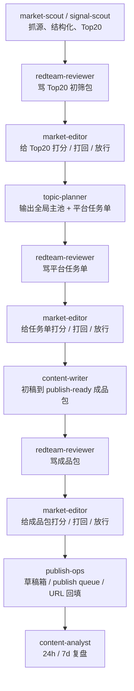

# 同行资本市场内容系统｜多 Agent Stage-Gate Runbook

## 1. 目的

这份 runbook 用来把 `2026-03-27` 正式启用的多 agent 组织法落地成可执行交接。

核心原则只有一句：

> 每个正式工序都必须经过 `交付稿 + 骂稿 + market-editor 打分 / 打回 / 放行`。

补充边界：

- `redteam-reviewer` 与 `market-editor` 的 KPI 不是把所有结果都否掉，而是**在尽量保留高价值对象的前提下，帮助各工位把同一对象做强**。
- 默认策略是 **先补救，后淘汰**：先补证、补覆盖、改角度、改质量，只有在事实失真、事件过时、方向严重偏离或补救后仍不成立时，才建议换题。

当前 runtime 兼容说明：

- agent id 仍保留 `market-scout`
- 但其职责应按 `signal-scout` 语义执行

---

## 2. 正式工序

---

## 3. 文件对象与命名

### 3.1 `signal-scout / market-scout`
- 输出：`/Users/apple/Documents/同行资本内容部门/内容生产系统/03_topic_candidates/YYYYMMDD__top20-screening-pack.md`
- 模板：`/Users/apple/Documents/同行资本内容部门/内容生产系统/09_runbooks/templates/market_top20_screening_pack_template.md`

### 3.2 `redteam-reviewer`
- 输出：`/Users/apple/Documents/同行资本内容部门/内容生产系统/10_logs/YYYYMMDD__<stage>__redteam-review.md`
- 模板：`/Users/apple/Documents/同行资本内容部门/内容生产系统/09_runbooks/templates/market_redteam_review_template.md`

### 3.3 `market-editor`
- 输出：`/Users/apple/Documents/同行资本内容部门/内容生产系统/10_logs/YYYYMMDD__<stage>__stage-gate-scorecard.md`
- 模板：`/Users/apple/Documents/同行资本内容部门/内容生产系统/09_runbooks/templates/market_stage_gate_scorecard_template.md`

### 3.4 `topic-planner`
- 输出：`/Users/apple/Documents/同行资本内容部门/内容生产系统/03_topic_candidates/YYYYMMDD__platform-task-sheet.md`
- 模板：`/Users/apple/Documents/同行资本内容部门/内容生产系统/09_runbooks/templates/market_platform_task_sheet_template.md`

### 3.5 `content-writer`
- 输出目录：`/Users/apple/Documents/同行资本内容部门/内容生产系统/05_draft_packs/<topic_key>/`
- 必含：平台稿、图文结构计划、配图 brief、必要时 docx 导出

### 3.6 `publish-ops`
- 输出目录：`/Users/apple/Documents/同行资本内容部门/内容生产系统/06_publish_queue/`

### 3.7 `content-analyst`
- 输出目录：`/Users/apple/Documents/同行资本内容部门/内容生产系统/07_performance_reviews/`
- 额外输出：`/Users/apple/Documents/同行资本内容部门/内容生产系统/08_brand_assets/YYYYMMDD__head-media-learning-memo-v1.md`
- 前台板面：`/Users/apple/Documents/同行资本内容部门/内容生产系统/11_frontstage/YYYYMMDD__head-media-learning-board.{html,md,snapshot.json}`

---

## 4. 各阶段最低通过标准

### Stage A｜Top20 初筛包
必须包含：
- 先产出一份“真实文件清单”，只基于真实存在的 `source_packets / asset_chains / topic_clusters / capture summaries / deep articles` 工作
- 如果当天没有新文件，允许回退到最近一轮可用 `data_token`，但必须在交付中写清楚实际使用的是哪一天的数据
- 每个候选必须有稳定 `topic_key`，供 `Top20 → 平台任务单 → approved_topic` 全链路校验
- 候选题标题、来源、发布时间、原始链接
- 一手性 / 传播性 / 破圈性 / 赛道匹配 / 可延展性等结构化评分
- 关键证据摘要
- 视觉素材可用性
- Top20 排序与入围理由

### Stage B｜平台任务单
必须包含：
- `Top6 全局主池`
- `wechat / xiaohongshu / zhihu / x / bilibili / toutiao` 各 `2` 个任务槽位
- 每个平台任务的目标人群、切入角度、核心论点、证据抓手、`source_ref_bundle`、视觉建议
- holdout 解释
- 百家号是否升格独立承接的判断
- 一旦平台任务单通过 `market-editor` 的 `8+` stage-gate，必须立即物化为 `04_approved_topics/` 下游任务卡，禁止只停留在 markdown 任务单层

### Stage C｜publish-ready 成品包
必须包含：
- 至少一版真正可发的平台稿
- 背景交代与钩子
- 证据引用与原始链接回链
- 图文结构计划
- 必要配图 / 截图建议
- 平台化标题、封面、排版方案

### Stage D｜发布交付包
必须包含：
- 平台 queue item
- 当前状态
- 草稿箱 / 交付对象说明
- 人工待执行事项
- 发布后 URL 回填位

### Stage E｜24h / 7d review
必须包含：
- 基础表现数据
- 评论 / 收藏 / 阅读完成相关信号
- 成功因子
- 失败因子
- 下一轮可执行优化建议

---

## 5. 打回与补救规则

- `8` 分以下：一律返工，但**不一律停摆**
- 打回必须写清：
  - 为什么低于 `8`
  - 最优先修哪三件事
  - 哪些问题如果不修，会继续伤害结果
- 打回时优先修结构与证据，不先修表面语气

### 5.1 默认动作：保留原对象返工，不直接否掉

- `Top20 / 平台任务单 / 成品包` 被打回时，默认都是**保留原对象返工**
- `redteam-reviewer` 与 `market-editor` 不得因为“当前证据不够完整”就直接建议换题
- 只有以下情况，才允许建议 `replace_topic`：
  - 事实错误或核心叙述失真
  - 事件已明显过时，时效性窗口关闭
  - 明显偏离主战场 / 目标用户 / 平台任务
  - 已完成一轮合理补救后，仍无法满足最低可信度或平台适配要求

### 5.2 问题类型对应的返工顺序

- `证据不足 / 原始链接缺失 / 财务口径没落地`：先补证、补原文、补公开披露，再复评；**不先换题**
- `热度不足 / 覆盖验证不足 / 讨论面太窄`：先扩平台验证、补评论和热度覆盖，再复评；**不先换题**
- `切入角度不好 / 平台错配 / 立意不准`：先改角度、改叙事、改平台表达，再复评；**不先换题**
- `结构、标题、钩子、图文节奏、阅读体验差`：先改质量、改排版、改图文组织，再复评；**不先换题**
- `事实失真 / 严重误导 / 主方向偏航`：才进入降级、剔除或换题判断

### 5.3 红队与裁判的“最小核查义务”

- `redteam-reviewer` 在指控“缺证 / 覆盖不足 / 热度不足”前，必须先完成一次**最小补证搜索**
- 最小补证搜索的顺序：
  1. 回读交付物内部已有 `source refs / evidence hint / manifest / 原链接`
  2. 回读上游任务单、approved topic、draft pack 中已经给出的线索
  3. 必要时做最小外部检索，确认公开材料里是否已有可用证据
- 只有在完成上述最小核查后，仍拿不到足够支撑，才能把问题定性为“待补证”
- `market-editor` 在打回时，必须写清楚本轮属于哪一种返工模式：`supplement_evidence / expand_validation / rewrite_angle / rewrite_quality / replace_topic`

### 5.4 `market-editor` 的统筹职责：骂的是对象，不是当前岗位

- `redteam-reviewer` 的骂稿针对的是**当前交付对象**，不是只针对“当前岗位的人”
- `market-editor` 拿到 `交付稿 + 骂稿` 后，必须把问题拆成**跨岗位协同返工计划**，而不是只把稿子原路扔回去
- 默认协同映射如下：
  - `证据不足 / 原始链接缺失 / 热度覆盖不够`：优先联动 `signal-scout / market-scout + 当前生产岗位`
  - `角度不准 / 平台错配 / 锁题表达有偏差`：优先联动 `topic-planner + 当前生产岗位`
  - `正文结构、标题、钩子、展开、平台感不足`：优先联动 `content-writer`
  - `图片、排版、素材路径、桥接上传、草稿箱交付问题`：优先联动 `content-writer + publish-ops`
- `market-editor` 的 scorecard 里，`next_owner` 必须允许写多个岗位，用 `+` 连接；必要时把“谁补证、谁改稿、谁补图、谁负责上传”写清楚
- 如果当前对象仍具备成立基础，`market-editor` 的默认动作是**组织补救并继续推进当前对象**，而不是因为一个岗位没一次写好就整题作废

### 5.5 `8` 分线是 premium gate，不是全厂停摆阀门

- `8+` 仍然是 premium lane 的正式放行标准，这条线不降。
- `8` 分以下默认进入 `continuity lane`：对象继续留在当前工序返工，但系统不得因此把整天产出归零。
- `continuity lane` 的目标不是偷放低质量对象，而是保证当天仍有正式、可追踪、可继续推进的产物。
- 允许的 continuity 产物主要有四类：
  - `Top20 mini slate`：当日 Top20 仍未过 `8`，但可冻结 `3-5` 个高置信候选，供下游做有限锁题参考。
  - `limited platform task sheet`：平台任务单未过 `8`，但可为最多 `3` 个主平台各锁 `1` 个高置信槽位，明确这是 continuity-only，而不是 premium pass。
  - `best available same-day content pack`：若当天成品包都未过 `8`，但存在 `7.0+`、事实成立、内容卫生达标、且至少一个平台已被明确写成 `publish_ready_platforms` 的对象，则该平台允许进入 continuity-only 的发布队列；若还没有任何平台达到可交付，也必须把最高分对象保留为当日 `P0` 返工对象继续推进，而不是整天挂零。
  - `publish continuity backlog`：若当天没有可交付的新对象，`publish-ops` 才扫描最近 `7` 天仍可发布的 premium pass backlog；若库存为 `0`，必须把“库存为零”写成正式日志，而不是默默 no-op。
- 只有当对象触发 `事实失真 / 时效失效 / 方向严重偏航 / 补救后仍不成立` 这类 truth failure，才允许既不放行 premium，也不进入 continuity。

---

## 6. 特别边界

- 对外只有 `market-editor`
- 其他工位全部独立 workspace / session 运行
- 内容工厂不得污染虚拟 VC 研究线
- `content-writer` 可主动补料，也可正式向 `market-scout` 提补料需求
- `redteam-reviewer` 做的是**质检 + 补强建议**，不代替主工位大段生产；但在指控缺证前，必须完成最小核查并给出明确补救路径
- `market-editor` 打回时必须尊重岗位已有劳动，优先要求其**沿原对象修复问题**，而不是机械换题
- 若一个对象的主要问题是证据、覆盖、角度或质量，裁判应先要求对应岗位修这个问题本身，而不是直接否定对象价值
- 对 `content-pack` 阶段，若整体仍是 `rework`，但某个平台已经达到“可直接入草稿箱 / 可先行”的真实状态，scorecard 必须显式写出 `publish_ready_platforms`

## 7. 每日自动化排班

### 7.1 倒推后的硬截止

- `19:00` 前：`day_mainline` 的公众号成品必须已进入草稿箱 / publish queue，等待老板最终审阅
- `18:30` 前：`content-pack` 必须完成最后一轮 premium / continuity 判定，不能还停留在“没人接球”的状态
- `15:00` 前：平台任务单必须锁定当日主推进对象；即便未过 `8`，也要物化 continuity-only 有限任务单
- `14:30` 前：`Top20` 必须冻结
- `T-1 19:00 ~ T 12:20`：正式信息收集窗，只抓不拍板

### 7.2 抓源阶段：用 cron 扩大覆盖窗

抓源阶段不做最终拍板，只做增量收集、补链、全文深抓与结构化落盘。建议按以下窗口运行：

- `19:00 ~ 22:10`：前一日晚间窗口，重点吃晚发官方源、融资、社区高热、新增微信文章、视频热点
- `08:10 ~ 12:20`：当日上午窗口，重点吃融资 delta、官方更新、builder 扩散、微信全文深抓、破圈热度验证
- 不同 lane 分开跑，避免把官方、社区、视频、融资、微信全文深抓糊成一个超重任务

### 7.3 攻防阶段：用 heartbeat window，不用单次定生死

正式工序不按“固定一轮就结束”设计，而按“窗口内多轮攻防”设计：

- `Top20` 阶段：`market-scout -> redteam-reviewer -> market-editor`
- `平台任务单` 阶段：`topic-planner -> redteam-reviewer -> market-editor`
- `成品包` 阶段：`content-writer -> redteam-reviewer -> market-editor`
- `发布交付` 阶段：`publish-ops` 持续巡检最近通过裁判的成品包

执行纪律：

- 同一工序在窗口内允许多轮 `提交 -> 骂稿 -> 打分 -> 打回`
- `8` 分以下必须继续留在当前窗口重做，但必须同时判断是否需要准备 continuity 产物
- `8+` 允许进入 premium lane 下一工序
- `8` 分以下但非 truth failure，不得把整条链路打断；必须选择当前**最高分、最 truthful、最接近可交付**的对象继续走 continuity lane
- `market-editor` 在 `平台任务单` 通过后，必须立即把锁题结果物化成 `approved_topic`
- 每轮都允许 `no-op`，但不允许跳过前置工序
- 到窗口冻结点仍未达到 `8` 时，按以下 continuity 规则执行：
  - `Top20`：冻结 `Top3-5` 高置信 mini slate，并写清哪些问题阻止其进入 premium pass。
  - `平台任务单`：输出 `continuity_only` 的 limited task sheet，最多覆盖 `3` 个最重要平台，每个平台先保 `1` 个槽位，剩余平台写清 holdout。
  - `成品包`：优先把最接近 `8` 分的对象继续推进；若最高分对象已有 `publish_ready_platforms`，允许该平台 continuity-only 先交付；若还没有平台可交付，则继续围绕这个最高分对象返工，低分 backlog 不得长期挤占最有机会过线的对象。
  - `publish-ops`：优先消费当天 premium pass；若没有，再消费当天 same-day continuity pack；若当天仍没有可交付对象，再消费最近 `7` 天 backlog premium pass；若还没有，正式记录“可发布 premium backlog 为零”。

### 7.4 当前正式排班口径

#### 收集窗
- `market-scout`：`19:12 ~ 22:05` 与 `08:12 ~ 12:18` 多 lane 抓取
- `market-scout` 在做 `Top20` 之前，必须先运行 `09_runbooks/scripts/market_daily_source_manifest.py`，禁止手写或猜测 source packet 路径

#### Top20 心跳窗
- `14:00 ~ 14:30`｜`market-scout -> redteam-reviewer -> market-editor` 连续攻防
- 目标不是“一轮过”，而是至少保留 `7` 次完整攻防机会
- `14:30` 为最终冻结点；之后若无强制返工，不再继续改 `Top20`
- `12:20` 后如出现极强 late-breaking 事件，只允许补进 `0-2` 条，并必须写清替换原因

#### 平台锁题心跳窗
- `15:00 ~ 18:50`｜`topic-planner` 心跳巡检最终平台任务单
- `15:08 ~ 18:58`｜`redteam-reviewer` 心跳审查平台任务单
- `15:08 ~ 18:58`｜`market-editor` 心跳裁判平台任务单
- `18:00` 前若仍未过 `8` 分，视为 premium lane 事故；但系统必须落下 `continuity_only` limited task sheet，并在日志中写明阻塞点

#### 写稿与交付心跳窗
- `16:00 ~ 18:40`｜`content-writer` 心跳起稿 / 返工
- `16:08 ~ 18:48`｜`redteam-reviewer` 心跳审查成品包
- `16:12 ~ 18:52`｜`market-editor` 心跳裁判成品包
- `16:30 ~ 21:30`｜`publish-ops` 心跳交付 publish queue / 草稿箱
- `content-writer` 必须优先处理最接近 `8` 分的返工对象，再处理深度返工 backlog
- `publish-ops` 必须在无当日 premium pass 时运行 backlog continuity 扫描，不允许因为“今天没有新过线”就直接整段 no-op

#### 复盘
- `content-analyst` 不参与白天锁题与写稿节奏；白天独立刷新 `头部学习池 / 对标池`，晚些时候继续做 `24h / 7d` review

### 7.5 设计原则

- 用 `cron` 管理“窗口开启”和“信息摄入”
- 用 `heartbeat window` 管理“窗口内多轮攻防”
- 不让老板卡在中间拍板，老板只在 `19:00 ~ 21:30` 审最终成品
- 不允许因为窗口快结束就凑结果；必须如实暴露供给不足和卡点
